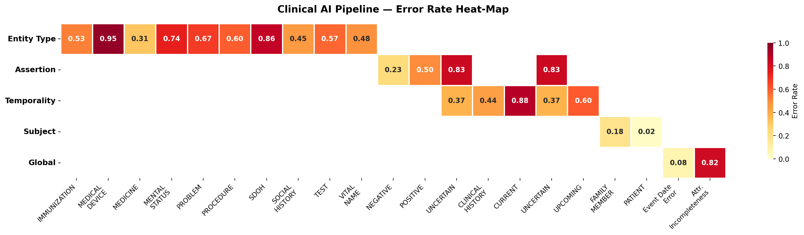

# Clinical AI Pipeline -- Evaluation Report

**Corpus:** 30 de-identified charts | ~16,500 entities | March 2026

---

## 1. Quantitative Evaluation Summary

| Metric | Value |
|---|---:|
| Charts evaluated | 30 |
| Entities evaluated | ~16,500 |
| Mean event date accuracy | 0.9218 |
| Mean attribute completeness | 0.1784 |

**Entity Type Error Rates**

| Type | Error Rate | Type | Error Rate |
|---|---:|---|---:|
| MEDICINE | 0.3145 | MEDICAL_DEVICE | 0.9538 |
| PROBLEM | 0.6710 | MENTAL_STATUS | 0.7361 |
| PROCEDURE | 0.5957 | SDOH | 0.8556 |
| TEST | 0.5750 | SOCIAL_HISTORY | 0.4541 |
| VITAL_NAME | 0.4819 | IMMUNIZATION | 0.5263 |

**Assertion Error Rates**

| POSITIVE | NEGATIVE | UNCERTAIN |
|---:|---:|---:|
| 0.5019 | 0.2312 | 0.8268 |

**Temporality Error Rates**

| CURRENT | CLINICAL_HISTORY | UPCOMING | UNCERTAIN |
|---:|---:|---:|---:|
| 0.8834 | 0.4379 | 0.6049 | 0.3714 |

**Subject Error Rates**

| PATIENT | FAMILY_MEMBER |
|---:|---:|
| 0.0201 | 0.1814 |

---

## 2. Error Heat-Map

---

## 3. Top Systemic Weaknesses

**W1 -- Entity type boundaries are poorly delineated.**
MEDICAL_DEVICE (0.95) and SDOH (0.86) are near-total failures. The model conflates devices with their procedures and social determinants with clinical terms. Cross-confusion between PROBLEM, PROCEDURE, TEST, and MEDICINE is pervasive.

**W2 -- Temporality defaults to CURRENT.**
At 0.88 error rate, CURRENT is the most unreliable label. The pipeline ignores section-level signals ("Past Medical History", "Follow-up") and collapses historical and planned events into the present tense.

**W3 -- Uncertainty language is not detected.**
UNCERTAIN assertion has a 0.83 error rate. Hedge phrases ("suggestive of but not diagnostic", "cannot exclude", "possible") are treated as affirmative, while confirmed entities in procedure reports are sometimes falsely negated.

**W4 -- Metadata extraction is sparse.**
Only 17.8% of expected QA attributes are present. Most MEDICINE entities lack dosage fields; most TEST entities lack result values. Medication-specific metadata (STRENGTH, UNIT) occasionally attaches to non-medication entities.

**W5 -- OCR artifacts leak into the entity layer.**
Placeholder tokens (`[ENCOUNTER_DATE]`, `encounter_date]`) and OCR noise are extracted as entities, corrupting downstream labels and inflating error rates.

---

## 4. Proposed Guardrails

**G1 -- Two-stage semantic verification.**
Gate A: LLM classifier produces candidate label + confidence. Gate B: ontology validator (SNOMED CT / RxNorm lookup) checks compatibility with heading and context. Accept only on consensus; escalate disagreements.

**G2 -- Scope-aware assertion engine.**
Replace keyword matching with structured NegEx: explicit trigger lists, defined scope windows, pseudo-negation guards, and a separate calibrated uncertainty classifier.

**G3 -- Section-aware temporal priors.**
Inject heading-level priors into the temporal classifier. "Past Medical History" biases toward CLINICAL_HISTORY; "Assessment and Plan" biases toward UPCOMING; "Findings" biases toward CURRENT. Override low-confidence LLM predictions when structural signals are strong.

**G4 -- Metadata consistency contracts.**
Enforce per-type attribute schemas. Auto-reject impossible attachments (e.g., STRENGTH on PROBLEM). Flag entities missing all required relations for QA re-processing.

**G5 -- Confidence-tiered output routing.**
Route entities into three tiers: *Accept* (all agents agree, confidence >= 0.85), *Accept with Warning* (minor disagreement, 0.60--0.84), *Reject for Review* (major disagreement or < 0.60). Escalate UNCERTAIN assertions and temporal conflicts to human review.

**G6 -- Input sanitization layer.**
Strip PHI placeholder tokens and OCR artifacts before entity extraction. Deduplicate overlapping text-span extractions.
